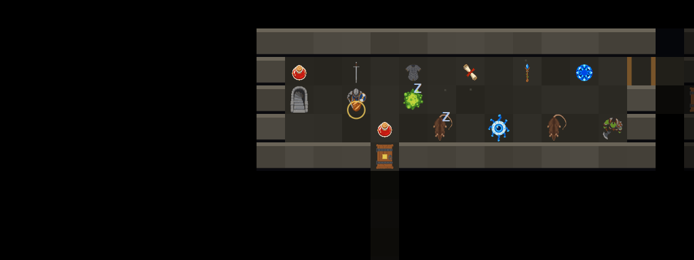

# claudeHack &amp; claudeSouls

Two browser roguelikes sharing one small engine. No install, no build step, no
server, no dependencies — the repository *is* the site.

**Play:** https://darkbearlab.github.io/claudeHack_roguelike/

| | | |
| --- | --- | --- |
| **[claudeHack](classic/)** | a NetHack-like | **playable** |
| **[claudeSouls](claudeSouls/)** | a turn-based Souls-like | **playable** |

---

## claudeHack — [play](https://darkbearlab.github.io/claudeHack_roguelike/classic/) · [readme](classic/README.md)

26 dungeon levels, 63 monster species, 200 object types whose identities are
reshuffled every game. Descend, take the Amulet of Yendor, carry it back up.
One life, no undo. Keyboard or entirely by thumb.

There is a **[中文新手指南](classic/docs/GUIDE.zh-TW.md)** for players who have
never touched NetHack; the same text is in the game under <kbd>?</kbd>.



## claudeSouls — [play](https://darkbearlab.github.io/claudeHack_roguelike/claudeSouls/) · [design](claudeSouls/docs/DESIGN.md)

Souls-like read-and-react combat, made turn-based. Enemies wind up before they
strike — a `!`, a countdown, red tiles, and they turn to face you. Attacks
always land and health is thin enough that three or four of them kill you, so
you cannot tank damage; you can only be somewhere else.

**Rolling costs stamina and does not advance the turn.** That one rule moves the
clock from turns to stamina, and every moment becomes the same question: one
more hit, or keep enough to get out?

Ten floors, eleven enemy species, bonfires that heal you and resurrect
everything, and floors derived from the run seed — so a floor you have died on
is a floor you have learned. Press a skill and drag out from your character to
aim; release to commit.

The design document also records what was rejected and why — parry, poise,
posture, shortcuts, loot treadmills.

---

## How the two share code

```
index.html            the chooser
engine/               rng · helpers · field of view · pathfinding
assets/               57 generated sprites, shared
classic/              claudeHack   — its own html, css, js, tools, docs
claudeSouls/          claudeSouls  — the same
docs/                 project-wide: development log, asset pipeline
tools/                dev server, asset generation scripts
```

**The shared boundary is drawn deliberately narrowly.** `engine/` holds only the
four modules with *no game knowledge at all*: seeded RNG, direction/distance
helpers, recursive-shadowcasting field of view, and A\* plus flow-field
pathfinding. They are the pieces that are subtle to get right and that nobody
wants to debug twice.

Everything else — tiles, level generation, the renderer, the UI machinery — is
**copied** into each game and allowed to drift. That is not laziness:

- Shared code creates pressure that *resists divergence*. If both games imported
  one `combat.js`, changing it for one risks breaking the other, and you start
  writing `if (mode === ...)`. A few months of that and neither game is
  pleasant to work on.
- With only one consumer, any "engine API" you design is a guess. The second
  consumer always wants something slightly different, and then you change the
  interface and break the first.

The rule for promoting something into `engine/` is: **two games have been using
identical copies of it for a while.** Copying 450 lines of renderer is cheap; a
wrong abstraction is not.

Drawing the line already surfaced two hidden couplings worth fixing:
`path.js` was importing claudeHack's *game rule* that you cannot cut the corner
of a doorway (the level is now asked, via `level.diagonalOk()`), and `fov.js`
contained `lightRadius()`, which reads lamps and blindness off the player and is
therefore game logic, not engine.

## Running it locally

Any static server works — the games are plain ES modules, so `file://` will not.

```bash
python tools/devserver.py 8778
```

Then open http://localhost:8778. The dev server sends `Cache-Control: no-store`
and is threaded; both matter more than they sound like they should, and
[docs/DEVLOG.md](docs/DEVLOG.md) explains why.

## Tests

Each game owns its tests and runs them from its own directory, so work on one
can never turn the other's CI red. Neither needs a browser or an install: the
game cores have no DOM dependency and run headless under Node.

```bash
cd classic
node tools/systest.mjs              # 22 assertions; the contract
node tools/smoketest.mjs 40 3000    # random-input crash fuzzing
node tools/botrun.mjs 12 30000      # a bot that plays to win
node tools/build_guide.mjs --check  # the Chinese guide is in sync

cd ../claudeSouls
node tools/systest.mjs              # 26 assertions, mostly on the combat contract
node tools/botrun.mjs --report 12   # a bot that reads every telegraph
```

claudeSouls' bot is a genuine balance instrument in a way claudeHack's could
never be. There, a fight was a distribution over dice. Here the combat is
deterministic and fully observed, so a bot that plays *correctly* answers a real
question: **is this winnable by someone who reads every wind-up and never wastes
stamina?** It found that the heavy vow was strictly better than the light one —
zero deaths a run versus repeated ones — which meant the choice was not a
choice. Halving heavy's roll distance fixed it, and a test now asserts the
trade.

## Deployment

The repository is the site; there is no build step, so GitHub Pages serves
`main` directly and every push is published. It needs one setting, set once:

> **Settings → Pages → Build and deployment → Source: _Deploy from a branch_**
> → branch **`main`**, folder **`/ (root)`**

## Documentation

- **[classic/docs/GUIDE.zh-TW.md](classic/docs/GUIDE.zh-TW.md)** — 中文新手指南
- **[claudeSouls/docs/DESIGN.md](claudeSouls/docs/DESIGN.md)** — claudeSouls 設計文件(含實作後的修正)
- **[classic/docs/DESIGN.md](classic/docs/DESIGN.md)** — claudeHack's design decisions
- **[classic/docs/TESTING.md](classic/docs/TESTING.md)** — what each test harness can prove
- **[docs/DEVLOG.md](docs/DEVLOG.md)** — how this was built, and the bugs that mattered
- **[docs/ASSETS.md](docs/ASSETS.md)** — the art pipeline, and a measured palette experiment

## Credits and licence

Written by Claude (Opus 5) for DarkBearLab. Sprites generated with the local
asset toolkit at `c:/claude_project/asset_generator`.

Indebted to **NetHack** and to **Dark Souls**, openly. Neither game is a port and
neither shares code with its inspiration.

MIT licensed — see [LICENSE](LICENSE).
